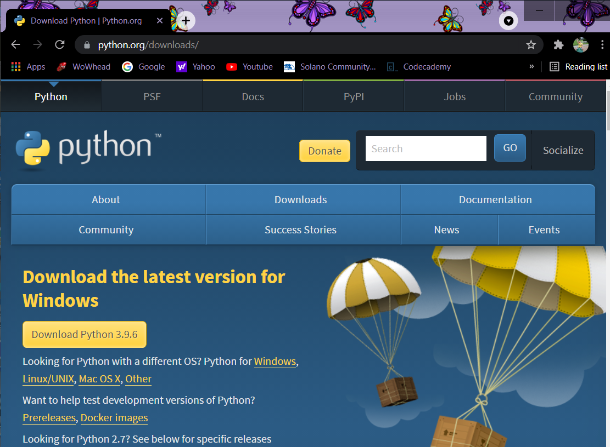
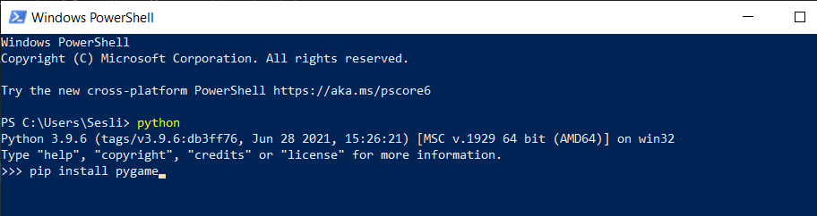

# PythonPlay

Learning and playing with python and pygame.
Some things may not make logical sense as I'll be playing with what does/does not work, causes crashes, following the logic, intentionally and unintentionally breaking it.

This should not be expected to be a polished project, but rather a coding equivalent to doodles on a notecard.

1 --Installed python added to C: PATH

2 -- checked python installed properly and path worked 
3 -- installed pygame

W3Schools has a section on python https://www.w3schools.com/python/

**Indentation IS important to python. Functions and conditional statements use indentation NOT brackets to indicate inclusivity**

**Naming convention for python is to use underscores instead of cammel case ie: i_love_waterbuffalo not iLoveWaterbuffalo the exception is with classes where you cammel case with a capital first letter ie: BabyKangaroo**